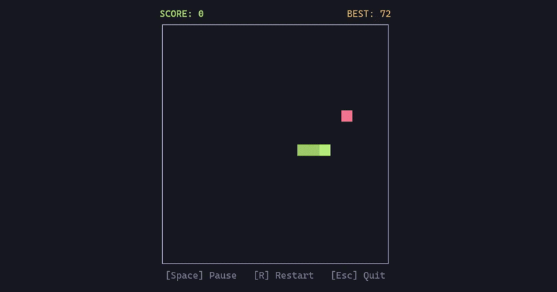

# Ratatui Snake

A classic Snake game in Rust using [Ratatui](https://github.com/ratatui-org/ratatui) and [Crossterm](https://github.com/crossterm-rs/crossterm).



## Installation

Install directly with cargo:

```bash
cargo install ratatui-snake
```

Or build from source:

```bash
git clone https://github.com/axelfrache/ratatui-snake
cd ratatui-snake
cargo run --release
```

## Controls

| Key | Action |
|-----|--------|
| `↑` `↓` `←` `→` | Move |
| `W` `A` `S` `D` | Alternative move (WASD) |
| `Space` | Pause |
| `R` | Restart |
| `Esc` | Quit |

## Features

- TUI interface with Ratatui
- Score tracking with best score persistence
- Pause and restart functionality

## License

This project is licensed under the MIT License - see the [LICENSE](LICENSE) file for details.
